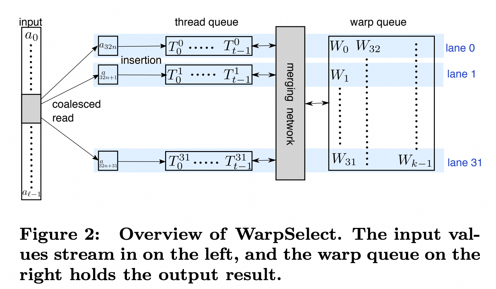
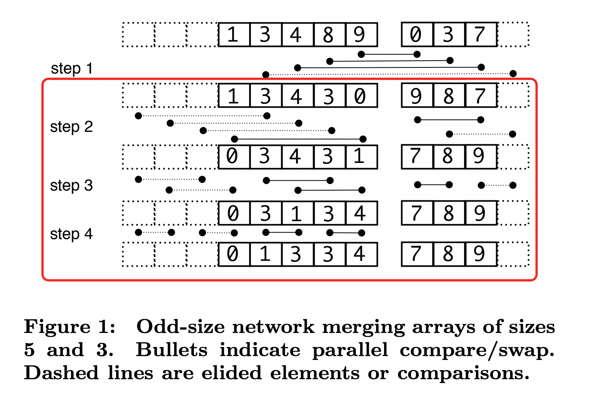
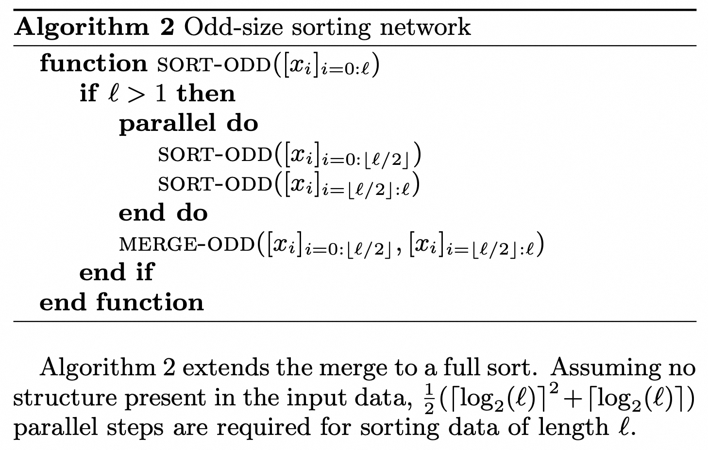

# TopK

## topk_radix_select — Radix Select

### 算法思想

不排序，逐 bit 缩小候选范围，确定第 K 大的值。

**核心变量**：

- `desired`：正在逐 bit 构建的第 K 大的值。每轮确定一个 bit，32 轮后 `desired` 就是精确的第 K 大。
- `desired_mask`：记录哪些 bit 已经确定。用 `(val & desired_mask) == desired` 过滤出当前候选集。
- `remaining_k`：在当前候选集中，目标是第几大。每次排除掉一批比目标大的元素时，remaining_k 相应减小。

从最高位（bit 31）开始，每轮统计满足已确定高位的元素中，当前 bit 为 1 的有多少个：
- 若 count ≥ remaining_k：说明第 K 大的数在当前 bit 为 1 的这批里，确定该 bit 为 1
- 若 count < remaining_k：第 K 大在该 bit 为 0 的那批里，remaining_k -= count，该 bit 为 0

32 轮后精确确定第 K 大的值（`desired`），最后收集所有 ≥ desired 的元素。

### V0：基础版本 [`633a251`](https://github.com/guluguluhhhh/wuda/commit/633a251)

每线程处理 1 个元素，每轮用 `__ballot_sync` + `__popc` 统计 warp 内满足条件且当前 bit 为 1 的数量，block reduce 后 atomicAdd 到全局 `state->count`。

block 间同步采用 **Last Block 决策模式**：

```
1. 每个 block 完成计数后 atomicAdd(&block_finished, 1)
2. 最后一个完成的 block（finished == gridDim.x - 1）负责决策：
   - 根据 count 和 remaining_k 更新 desired
   - 清零 count，递增 generation
3. 其他 block 轮询 generation，等待决策完成后进入下一轮
```

**为什么是 Last Block**：只有最后一个 block 能确保全局 count 已完整汇总。

### 优化 1：Grid-stride loop [`8b194c7`](https://github.com/guluguluhhhh/wuda/commit/8b194c7)

基础版本每线程只处理 1 个元素，需要 N/1024 个 block。改为 grid-stride loop：固定 block 数，每线程循环处理多个元素，本地累加 count 后再做一次 block reduce。

减少了 block 数，降低了 atomicAdd 和 block 间同步的压力。

### 优化 2：8-bit 分桶 [`67f1aff`](https://github.com/guluguluhhhh/wuda/commit/67f1aff)

从每轮 1 bit 改为每轮 8 bit，32 轮变 4 轮，数据只需扫描 4 遍。

每轮对当前 8 bit 分成 256 个桶，用 smem 局部直方图 + atomicAdd 汇总到全局 `hist[256]`。Last block 从大到小累计 hist 找到第 K 大落在哪个桶，更新 desired。

代价是需要 256 个桶的 smem atomicAdd（有竞争），但总遍历次数从 32 降到 4。

### Benchmark（RTX 5090, K=1000）

| N | Blocks | Time (ms) | 带宽 |
|---|---|---|---|
| 100M | 170 | 1.292 | 310 GB/s |
| 500M | 170 | 6.094 | 328 GB/s |
| 1G | 170 | 12.122 | 330 GB/s |
| 2G | 170 | 24.125 | 332 GB/s |

### 分析

有效带宽 ~330 GB/s（峰值 18%），但实际 4 轮各扫描一遍全部数据（条件过滤无法跳过读取），有效读取量约 4×N×4B。修正后实际带宽约 1.3 TB/s，接近峰值的 73%。

---

## topk_radix_select_cg — Cooperative Groups 版本

原版 block 间同步逻辑：每个 block 计数完后 `atomicAdd(&block_finished, 1)`，最后一个完成的 block 检测到自己是 last block，负责决策并递增 `generation`；其他 block 用 `while (generation < ...)` 忙等（`generation` 是全局计数器，记录已完成几轮 pass，本质是手写的屏障信号）。需要手写 `block_finished` 计数、last block 判断、`generation` 轮询，逻辑分散且容易出错。

CG 版本直接用 `grid.sync()` 替代整套同步逻辑：所有 block 计数完 → `grid.sync()` → block 0 决策 → `grid.sync()` → 进入下一轮。不需要 `block_finished`、`generation` 字段，代码更直观。

### 性能对比（RTX 5090, K=1000, N=2G）

| 版本 | Time | 带宽 |
|---|---|---|
| radix_select | 24.125 ms | 332 GB/s |
| radix_select_cg | 27.928 ms | 286 GB/s |

CG 版本略慢约 16%。但 radix select 本身就需要全局同步（所有 block 计数完才能决策），`grid.sync()` 替代的正是这个全局屏障，和手写 last block 模式做的是同一件事，所以性能损失不大。与 scan 不同（scan 只有前向依赖，不需要全局屏障），topk 的全局同步是算法固有需求，CG 在这类场景下是合理的选择。

---

## topk_warp_select — WarpSelect

参考论文：[Billion-scale similarity search with GPUs (Johnson et al., 2017)](https://arxiv.org/pdf/1702.08734)

### 算法思想

与 radix select 完全不同的思路：不做全局统计，而是**流式扫描数据，用一个固定大小的有序队列持续淘汰**。只需扫描一遍数据，且队列维护和淘汰在寄存器中完成。

核心数据结构（每个 warp 维护）：

- **warp_queue**：大小为 K，跨 32 个 lane 以 lane-stride 方式存储，保持升序。存放当前已知的 top-K 最小的 K 个值。
- **thread_queue**：每个 lane 私有的 T 个寄存器，保持升序。作为缓冲区暂存新来的候选元素，满了再和 warp_queue 合并。

这里需要结合代码理解的是，两个队列逻辑上都是全局有序的，但物理上被打散到warp里的每个thread/lane来存放



**流程**：

```
1. 读入一个元素 val
2. 如果 val < thread_queue 的最大值，插入 thread_queue 并保持有序
3. 如果 warp 内任何 lane 的 thread_queue 最大值 < warp_queue 的全局最大值，
   说明有更好的候选 → 触发 restore：
   a. sort_odd：对 thread_queue（32*T 个元素）做全排序
   b. merge_odd：将排好序的 thread_queue 与 warp_queue 合并，保留最小的 K 个
4. 扫描完所有数据后 finalize，得到 top-K
```

### 问题拆分

WarpSelect 的核心计算是在 warp 内用 shuffle 做排序和合并。数据以 **lane-stride** 方式分布在 32 个 lane 的寄存器中（element i 在 lane `i%32` 的第 `i/32` 个寄存器），所有操作通过 `__shfl_xor_sync` / `__shfl_sync` 跨 lane 交换数据。

需要实现三个排序网络原语：

```
merge_odd_continue  →  merge_odd  →  sort_odd  →  WarpSelect
（子问题排序）         （合并两段）    （全排序）      （流式选择）
```

### 实现 1：merge_odd_continue [`0e19739`](https://github.com/guluguluhhhh/wuda/commit/0e19739)

论文 Algorithm 1 的递归部分。对一个长度为 LEN（32 的倍数）的 lane-stride 数组做 odd-size bitonic merge。

```
1. 找到最大的 2^k < LEN，记为 H
2. 前 LEN-H 个元素与后 LEN-H 个元素做 compare-swap（间距为 H）
3. 递归：分别对前半和后半排序
4. 基础情况 LEN=32：用 shfl_xor 做 5 轮 warp 内 compare-swap
```

`IsLeft` 模板参数标记 dummy 元素（因为 LEN 不是 2 的幂，会有填充）在左边还是右边，影响递归拆分方式。

### 实现 2：merge_odd + sort_odd [`918e035`](https://github.com/guluguluhhhh/wuda/commit/918e035)

**merge_odd**（Algorithm 1 完整版）：合并两个已排序的 lane-stride 数组 L 和 R。

```
第一步 inverted comparison：
  L 逆序与 R 正序做 compare-swap，小的留 L 大的留 R
  （通过 __shfl_sync(val, 31-lane_id) 实现逆序访问）
第二步：L 和 R 各自调用 merge_odd_continue 排序
```

**sort_odd**（Algorithm 2）：对 lane-stride 数组做全排序。递归二分 → sort 左半 → sort 右半 → merge_odd 合并。基础情况 LEN=32 用标准 bitonic sort。


### 实现 3：WarpSelect + first pass [`d90c25d`](https://github.com/guluguluhhhh/wuda/commit/d90c25d)

将排序原语组装成 WarpSelect 结构体，实现 `add()` / `restore()` / `finalize()` 接口。

Pass 1 kernel：每个 warp 用 grid-stride loop 扫描数据，维护自己的 WarpSelect。扫描完后 block 内各 warp 结果写入 smem，warp 0 做二次选择，输出每个 block 的 top-K。

### 实现 4：two-pass + deadlock fix [`8d6d571`](https://github.com/guluguluhhhh/wuda/commit/8d6d571)

添加 Pass 2 kernel：单 warp 对所有 block 的 top-K 结果做最终选择。

修复死锁：`add()` 中的 `__any_sync` 要求 warp 内所有 lane 参与，但 grid-stride loop 的边界条件可能导致部分 lane 不进入循环。改为 `i - lane_id < n`（整个 warp 统一进退）。

### Benchmark（RTX 5090, K=64）

| N | Blocks | Time (ms) | 带宽 |
|---|---|---|---|
| 100M | 128 | 0.418 | 957 GB/s |
| 500M | 128 | 1.610 | 1.24 TB/s |
| 1G | 128 | 3.086 | 1.30 TB/s |
| 2G | 128 | 6.024 | 1.33 TB/s |

### 对比 radix_select（N=2G）

| 版本 | 遍历次数 | Time | 带宽 |
|---|---|---|---|
| radix_select | 4 遍 | 24.125 ms | 332 GB/s |
| warp_select | 1 遍 | 6.024 ms | 1.33 TB/s |

warp_select 快 4 倍，核心优势是只需扫描一遍数据。radix_select 每轮都要遍历全部元素做统计，而 warp_select 用寄存器队列在线淘汰，数据读一次就够了。
